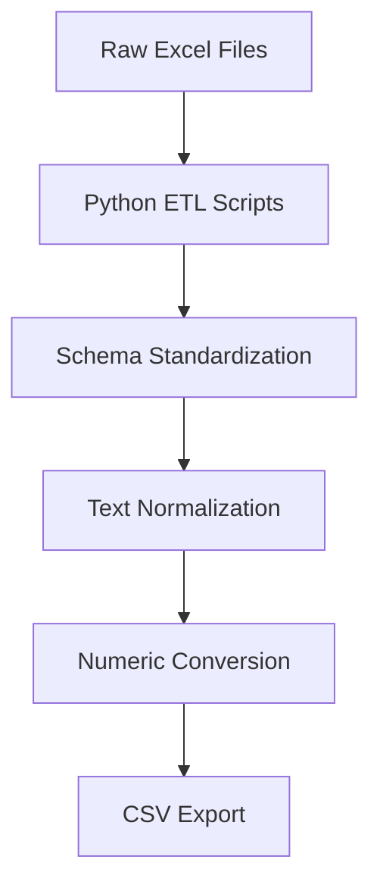

# KBA Market Analysis – German Vehicle Registration Trends (2015–2025)

Comprehensive analysis of German automotive market evolution using official 
Kraftfahrt-Bundesamt (KBA) vehicle registration data across a decade of transformation.

## Table of Contents

1. [Problem Statement](#problem-statement)
2. [Solution Overview](#solution-overview)
3. [Folder Structure](#folder-structure)
4. [Quickstart](#quickstart)
5. [Usage Examples](#usage-examples)
6. [Configuration](#configuration)
7. [Data Pipeline Workflow](#data-pipeline-workflow)
8. [Testing & Quality Assurance](#testing--quality-assurance)
9. [Continuous Integration](#continuous-integration)
10. [Contributing](#contributing)
11. [License](#license)
12. [Roadmap](#roadmap)
13. [Acknowledgements](#acknowledgements)

---

## Problem Statement

The German automotive market underwent significant structural changes between 2015 
and 2025, driven by environmental regulations, electrification trends, and shifting 
consumer preferences. However, analyzing these trends requires processing complex, 
multi-format official registration data scattered across different KBA statistical 
series (FZ1, FZ2, FZ3, FZ8, FZ10).

Key analytical challenges include:
- **Data fragmentation**: Multiple Excel formats across different time periods
- **Schema evolution**: Column structures changed between 2020-2022 and 2023-2025
- **German formatting**: Decimal separators, special characters, and encoding issues
- **Scale complexity**: Millions of records across 50+ monthly datasets

This project delivers a unified analytical framework for automotive market research, 
policy analysis, and sustainability assessment.

---

## Solution Overview

The KBA Market Analysis pipeline transforms raw government data into analytical-ready 
datasets through a multi-stage ETL process:

```
┌─────────────────┐    ┌─────────────────┐    ┌─────────────────┐
│   Raw KBA Data  │───▶│  Data Pipeline  │───▶│   Analytics     │
│   (Excel/PDF)   │    │   (Python/dbt)  │    │ (Jupyter/SQL)   │
└─────────────────┘    └─────────────────┘    └─────────────────┘
                               │
                               ▼
                    ┌─────────────────┐
                    │   PostgreSQL    │
                    │   Data Warehouse│
                    └─────────────────┘
```

**Architecture Components:**
- **ETL Layer**: Python scripts for Excel parsing and data standardization
- **Transformation Layer**: dbt models for data modeling and quality checks
- **Storage Layer**: PostgreSQL database with optimized schemas  
- **Analysis Layer**: Jupyter notebooks for exploratory data analysis
- **Visualization Layer**: Tableau dashboards (external)

---

## Folder Structure

```
kba_market_analysis/
├── data/                      # Data storage (gitignored for size)
│   ├── raw/                   # Original Excel/PDF files from KBA
│   │   ├── fz1/              # Vehicle stock by make/model
│   │   ├── fz2/              # New registrations by fuel type
│   │   ├── fz3/              # Commercial vehicle registrations  
│   │   ├── fz8/              # Monthly registration statistics
│   │   └── fz10/             # Regional breakdown data
│   └── processed/            # Cleaned CSV files for analysis
├── dbt_kba/                  # dbt project for data modeling
│   ├── models/               # SQL transformation models
│   ├── macros/              # Reusable SQL functions
│   ├── seeds/               # Reference data (lookup tables)
│   └── dbt_project.yml      # dbt project configuration
├── notebooks/               # Jupyter analysis notebooks
│   ├── _1_*.ipynb          # Data extraction workflows
│   ├── _2_*.ipynb          # Data transformation processes
│   └── _9_*.ipynb          # Database upload procedures
├── scripts/                 # Automation and utility scripts
│   ├── working_final/      # Production ETL notebooks
│   └── old/                # Deprecated/experimental code
├── docs/                   # Project documentation
├── __temp/                 # Temporary files (gitignored)
└── README.md              # This file
```

---

## Quickstart

### Prerequisites

- **Python 3.8+** with pip package manager
- **PostgreSQL 12+** database server (local or remote)
- **dbt Core 1.0+** for data transformation
- **Git** for version control

### Installation

1. **Clone the repository:**
   ```bash
   git clone https://github.com/artur-jodkowski/kba_market_analysis.git
   cd kba_market_analysis
   ```

2. **Set up Python environment:**
   ```bash
   python -m venv venv
   source venv/bin/activate  # On Windows: venv\Scripts\activate
   pip install pandas openpyxl sqlalchemy python-dotenv
   ```

3. **Configure database connection:**
   ```bash
   cp .env.example .env
   # Edit .env with your PostgreSQL credentials
   ```

4. **Initialize dbt project:**
   ```bash
   cd dbt_kba
   dbt debug  # Verify database connection
   ```

### Quick Data Processing

```bash
# Process a single data source (example: FZ8 2023-2025)
jupyter notebook scripts/working_final/_2_Artur_fz8_2023-2025.ipynb

# Upload processed data to database
jupyter notebook notebooks/_9_push_processed_data.ipynb

# Run dbt transformations
cd dbt_kba && dbt run
```

---

## Usage Examples

### Data Extraction Workflow

```python
# Extract FZ8 monthly registration data
from pathlib import Path
import pandas as pd
from openpyxl import load_workbook

# Load monthly KBA Excel file
data_dir = Path("data/raw/fz8")
df = pd.read_excel(data_dir / "fz8_202412.xlsx", sheet_name="FZ 8.2")

# Apply standardized cleaning
df = df.dropna(how="all")
df.columns = df.columns.str.strip().str.upper()
```

### Database Query Examples

```sql
-- Top 10 vehicle makes by 2024 registrations
SELECT marke, SUM(anzahl) as total_registrations
FROM kba_schema.fz_8_2_raw 
WHERE date LIKE '2024%'
GROUP BY marke 
ORDER BY total_registrations DESC 
LIMIT 10;

-- Electric vehicle adoption trends
SELECT date, fuel_type, COUNT(*) as registrations
FROM kba_schema.fz_2_processed
WHERE fuel_type IN ('ELEKTRO', 'HYBRID')
GROUP BY date, fuel_type
ORDER BY date;
```

### Analysis Notebook Execution

```bash
# Run full analysis pipeline
jupyter notebook notebooks/_1_Artur_fz8_2020-2022.ipynb  # Legacy data
jupyter notebook notebooks/_2_Artur_fz8_2023-2025.ipynb  # Current data
jupyter notebook notebooks/_4_Artur_fz1.ipynb            # Vehicle stock
```

---

## Configuration

### Environment Variables

Create a `.env` file with the following parameters:

```bash
# PostgreSQL Database Configuration
POSTGRES_HOST=localhost
POSTGRES_PORT=5432
POSTGRES_USER=your_username
POSTGRES_PASS=your_password
POSTGRES_DB=kba_analysis
POSTGRES_SCHEMA=kba_data

# Optional: Data Source Paths
KBA_DATA_PATH=/path/to/kba/downloads
PROCESSED_DATA_PATH=./data/processed
```

### dbt Configuration

Edit `dbt_kba/dbt_project.yml`:

```yaml
name: 'kba_market_analysis'
version: '1.0.0'
profile: 'default'

models:
  kba_market_analysis:
    staging:
      +materialized: view
    marts:
      +materialized: table
```

### Data Source Configuration

Notebook-specific configurations are embedded in each processing script:

- **FZ8 Configuration**: Monthly registration data processing
- **FZ1 Configuration**: Annual vehicle stock processing  
- **Text Column Handling**: Configurable number of preserved text columns
- **Date Parsing**: Automatic YYYYMM date extraction from filenames

---

## Data Pipeline Workflow

### 1. Data Acquisition
- **Manual Download**: KBA Excel files from official statistics portal
- **File Organization**: Structured placement in `data/raw/` subdirectories
- **Format Validation**: Automated sheet detection and structure verification

### 2. Data Extraction & Cleaning


### 3. Data Transformation (dbt)
- **Staging Models**: Raw data validation and type casting
- **Intermediate Models**: Business logic application
- **Mart Models**: Final analytical datasets

### 4. Data Loading
- **PostgreSQL Upload**: Automated table creation and data insertion
- **Schema Management**: Consistent column naming and data types
- **Incremental Processing**: Month-by-month data updates

### 5. Quality Assurance
- **Row Count Validation**: Cross-check against source files
- **Schema Drift Detection**: Automated header comparison
- **Data Completeness**: Missing value analysis and reporting

---

## Testing & Quality Assurance

### Data Quality Checks

Currently implemented through notebook-embedded validation:

```python
# Example validation from processing notebooks
def validate_data_completeness(df):
    """Check for unexpected missing values in key columns"""
    required_cols = ['MARKE', 'ANZAHL', 'DATE']
    for col in required_cols:
        missing_pct = df[col].isna().mean() * 100
        if missing_pct > 5:
            print(f"⚠️  {col}: {missing_pct:.1f}% missing values")
```

### Schema Validation

```python
# Header compatibility check between data periods
def validate_headers(df_2020, df_2023):
    """Ensure schema consistency across time periods"""
    if list(df_2020.columns) != list(df_2023.columns):
        print("❌ Schema mismatch detected")
        return False
    return True
```

### TODO: Comprehensive Test Suite

```bash
# Planned testing framework
pytest tests/test_data_extraction.py
pytest tests/test_data_quality.py  
pytest tests/test_database_upload.py
```

---

## Continuous Integration

**Current Status**: Manual execution workflows

**Planned CI/CD Pipeline:**

```yaml
# .github/workflows/data-pipeline.yml (planned)
name: KBA Data Pipeline
on:
  schedule:
    - cron: '0 6 1 * *'  # Monthly on 1st at 6 AM
jobs:
  data-extraction:
    runs-on: ubuntu-latest
    steps:
      - uses: actions/checkout@v3
      - name: Run data extraction
        run: python scripts/monthly_update.py
```

**Quality Gates:**
- Schema validation before database upload
- Row count verification against previous months
- Data completeness thresholds (>95% for key fields)

---

## Contributing

### Development Setup

1. Fork the repository and create a feature branch
2. Install development dependencies: `pip install -r requirements-dev.txt`
3. Follow the existing notebook commenting style (every line documented)
4. Test data processing with sample files before full runs

### Code Style

- **Notebook Comments**: Every code line includes explanatory comments
- **Function Documentation**: Comprehensive docstrings for all functions
- **Section Headers**: Clear markdown headers separating workflow stages
- **Variable Naming**: Descriptive names with consistent prefixes (`pg_`, `df_`, etc.)

### Pull Request Process

1. Ensure notebooks run end-to-end without errors
2. Update documentation for any configuration changes
3. Add validation checks for new data sources
4. Test database upload procedures with sample data

---

## License

This project is licensed under the MIT License - see the [LICENSE](LICENSE) file 
for details.

**Data License**: All KBA vehicle registration data remains subject to German 
federal statistics usage terms. This project provides tools for analysis; users 
are responsible for compliance with data usage regulations.

---

## Roadmap

### Phase 1: Infrastructure Hardening (Q1 2025)
- [ ] Migrate to Poetry for dependency management
- [ ] Implement comprehensive pytest test suite
- [ ] Add CI/CD pipeline with GitHub Actions
- [ ] Create Docker containers for reproducible environments

### Phase 2: Analysis Expansion (Q2 2025)
- [ ] Add time series forecasting models
- [ ] Implement regional analysis workflows
- [ ] Create automated report generation
- [ ] Build Streamlit dashboard for interactive exploration

### Phase 3: Production Deployment (Q3 2025)
- [ ] Cloud deployment (AWS/GCP)
- [ ] Automated KBA data ingestion
- [ ] Real-time dashboard updates
- [ ] API endpoint for external consumers

---

## Acknowledgements

### Data Sources
- **Kraftfahrt-Bundesamt (KBA)**: Official German vehicle registration statistics
- **Federal Statistical Office**: Supporting demographic and economic indicators

### Technical References
- **dbt Documentation**: Data transformation best practices
- **pandas Documentation**: Data manipulation techniques
- **PostgreSQL Manual**: Database optimization strategies

### Contributors
- **Artur Jodkowski**: Project lead and primary analyst
- **NeuesFische**: Educational framework and mentorship

---

## Brutally Honest Recommendations

### Critical Issues Requiring Immediate Attention

#### 1. **Missing Requirements Management** (High Impact, Low Effort)
**Problem**: No `requirements.txt`, `pyproject.toml`, or dependency specification.  
**Impact**: Potential environment conflicts, difficult onboarding, version drift.  
**Fix**: Create `requirements.txt` with pinned versions:
```bash
pandas==2.1.4
openpyxl==3.1.2
sqlalchemy==2.0.25
python-dotenv==1.0.0
psycopg2-binary==2.9.9
```

#### 2. **Hardcoded Database Credentials Risk** (High Impact, Medium Effort)
**Problem**: `.env` files referenced but not templated; risk of credential exposure.  
**Impact**: Security vulnerability, accidental credential commits.  
**Fix**: Create `.env.example` template and update gitignore validation.

#### 3. **Notebook-Driven Architecture Smell** (Medium Impact, High Effort)
**Problem**: Core ETL logic embedded in Jupyter notebooks instead of modules.  
**Impact**: Poor testability, difficult CI/CD, code duplication across notebooks.  
**Fix**: Extract processing functions to `src/kba_pipeline/` Python package.

#### 4. **dbt Project Misconfiguration** (Medium Impact, Low Effort)
**Problem**: dbt project still uses default `my_new_project` name and minimal config.  
**Impact**: Confusion, non-descriptive artifacts, poor maintainability.  
**Fix**: Update `dbt_project.yml` with proper project name and model configurations.

#### 5. **Zero Automated Testing** (High Impact, Medium Effort)
**Problem**: No test coverage for data processing, schema validation, or database operations.  
**Impact**: Silent data corruption, regression risks, difficult debugging.  
**Fix**: Implement pytest suite starting with schema validation tests.

#### 6. **Data Quality Validation Gaps** (Medium Impact, Medium Effort)
**Problem**: Ad-hoc validation scattered across notebooks without systematic approach.  
**Impact**: Data quality issues may propagate undetected through pipeline.  
**Fix**: Implement dbt tests and data quality monitoring framework.

### Architectural Improvements (Ordered by Impact/Effort Ratio)

#### 1. **Containerization** (High Impact, Medium Effort)
Create `Dockerfile` and `docker-compose.yml` for reproducible environments:
```dockerfile
FROM python:3.11-slim
WORKDIR /app
COPY requirements.txt .
RUN pip install -r requirements.txt
```

#### 2. **Configuration Management** (Medium Impact, Low Effort)
Replace scattered path configurations with centralized `config.yaml`:
```yaml
data:
  raw_dir: "data/raw"
  processed_dir: "data/processed"
database:
  schema: "kba_data"
processing:
  batch_size: 10000
```

#### 3. **Logging Framework** (Medium Impact, Low Effort)
Replace `print()` statements with structured logging:
```python
import logging
logging.basicConfig(level=logging.INFO, format='%(asctime)s - %(levelname)s - %(message)s')
logger = logging.getLogger(__name__)
```

#### 4. **Error Handling Robustness** (High Impact, Medium Effort)
Current notebooks have minimal error handling; add comprehensive exception management and rollback procedures.

#### 5. **Memory Optimization** (Low Impact, High Effort)
For large datasets, implement chunked processing and memory profiling to handle files exceeding available RAM.

### Security & Compliance Red Flags

#### 1. **Unencrypted Database Connections** (High Risk)
Verify PostgreSQL connections use SSL/TLS in production environments.

#### 2. **Data Retention Policy Missing** (Medium Risk)
No documented data retention or deletion procedures for GDPR compliance.

#### 3. **Access Control Gaps** (Medium Risk)
Database schema lacks role-based access controls for different user types.

### Performance Bottlenecks

#### 1. **Single-Threaded Processing** (High Impact)
Excel parsing could benefit from parallel processing for monthly batch updates.

#### 2. **Inefficient DataFrame Operations** (Medium Impact)
Multiple `apply()` operations could be vectorized for better performance.

#### 3. **Unoptimized Database Uploads** (Medium Impact)
Current bulk uploads lack batch optimization and connection pooling.

### Benchmark Against Industry Standards

**Current Grade: C+ (Functional but not production-ready)**  

To reach **A-grade** (FAANG-level quality):
- Implement comprehensive test coverage (>80%)
- Add monitoring and alerting infrastructure  
- Create proper API documentation
- Establish SLA definitions and error budgets
- Implement feature flags for experimental functionality

**Immediate Priority Order:**
1. Create `requirements.txt` (30 minutes)
2. Fix dbt project configuration (15 minutes)  
3. Add `.env.example` template (10 minutes)
4. Implement basic pytest structure (2 hours)
5. Extract notebook functions to modules (1 day)
